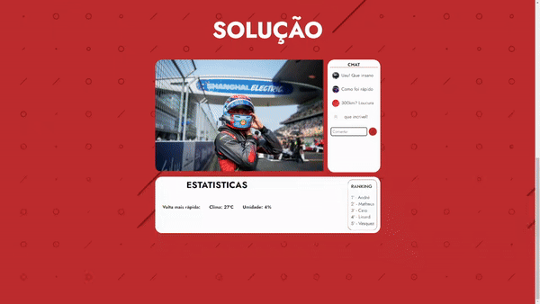

# Sprint Web Dev - Challenge Mahindra 🏎️

## Nomes & RM's

<h2>

<li>RM 555499 - Matheus Montovaneli</li>
<li>RM 554763 - Caio Suzano </li>
<li>RM 555768 - Guilherme Linard </li>
<li>RM 555159 - Lucas Vasquez Silva </li>
<li>RM 555004 - André Nakamatsu Rocha</li>

# Plataforma de Streaming usando JS!




## Explicando os <a href="https://github.com/mahindraracing/challenge/tree/main/assets/js">Códigos</a>


## `Chat Livestream usando DOM`

### 1. Captura e Validação do Comentário

```JS
document.getElementById("comment-form").addEventListener("submit", function (event) {
    event.preventDefault();

    const campo = document.getElementById("comment-input").value

    if (campo === "") {
        alert("Preencha o campo de comentário!")
        return;
    }
```

Nesta seção, o código captura o `evento de envio do formulário` de comentário. Em seguida, ele impede o comportamento padrão do formulário, garantindo que a página não seja `recarregada` ao enviar o formulário. Após isso, o código `verifica` se o campo de comentário está vazio. Se estiver vazio, exibe um `alerta e interrompe a execução do código`.

### 2. Criação dos Elementos do Comentário

```JS
 const commentValue = document.getElementById("comment-input").value;

    const newCommentDiv = document.createElement("div");
    newCommentDiv.classList.add("chat-containers");

    const newIconImg = document.createElement("img");

    newIconImg.src = "assets/img/noicon.jpg"; 
    newIconImg.alt = "Ícone";
    newIconImg.style.width = "25px";
    newIconImg.style.height = "25px";
    newIconImg.style.float = "left";
    newIconImg.style.marginRight = "10px";

    const newCommentPara = document.createElement("p");
    newCommentPara.classList.add("coment");
    newCommentPara.textContent = commentValue;

    newCommentDiv.appendChild(newIconImg);
    newCommentDiv.appendChild(newCommentPara);
```

Nesta seção, o código cria `elementos HTML` para representar o comentário. Ele cria uma nova `div` para o comentário, uma `imagem de ícone e um parágrafo` para o conteúdo do comentário. A imagem de ícone é definida com um caminho de origem, atributo alt e estilos `CSS`. O conteúdo do comentário é atribuído ao parágrafo criado.

### 3. Adição do Comentário à Página

```JS
const inputContainer = document.querySelector(".input_chat_mahindra");

    inputContainer.parentNode.insertBefore(newCommentDiv, inputContainer);

    document.getElementById("comment-input").value = "";
});
```

Nesta seção, o código seleciona o contêiner onde os comentários serão exibidos na página. Em seguida, insere a `nova div de comentário` antes desse contêiner. Por fim, `limpa o campo de entrada de comentário`, garantindo que esteja vazio após a adição do comentário à página.

## `Sistema de Login para acessar o site`

```js
document.querySelector('.btn-login').addEventListener('click', function() {
    const email = document.querySelector('.input_email').value;
    const senha = document.querySelector('.input_senha').value;

    if (email === 'challenge@email.email' && senha === '123') {
        alert('Login realizado');
        window.location.href = 'content.html';
    } else {
        alert('Email ou senha incorretos');
    }
});
```

Este trecho de código `JavaScript` trata da autenticação de login. Quando o botão de login é clicado, ele captura os `valores dos campos de entrada de email e senha`. Em seguida, verifica se esses valores correspondem aos valores específicos esperados (um email 'challenge@email.email' e uma senha '123'). Se as credenciais estiverem corretas, exibe um `alerta informando que o login foi realizado e redireciona o usuário para a página`. Caso contrário, exibe um alerta indicando que o email ou a senha está incorreta.

## `Slideshow (onde é simulado uma Stream)`

```JS
let slideIndex = 0;
showSlides();

function showSlides() {
  let i;
  const slides = document.getElementsByClassName("slide");
  
  for (i = 0; i < slides.length; i++) {
    slides[i].style.display = "none";  
  }
  
  slideIndex++;
  
  if (slideIndex > slides.length) {
    slideIndex = 1;
  }  
  
  slides[slideIndex - 1].style.display = "block";  
  setTimeout(showSlides, 7000); 
}
```


Este código `JavaScript` implementa um `slideshow`. Ele exibe uma sequência de slides, alternando automaticamente a `cada 7 segundos`. O código utiliza uma variável `slideIndex` para rastrear o slide atual. A função `showSlides()` oculta todos os slides e mostra apenas o próximo. Quando atinge o último slide, retorna ao primeiro. O slideshow continua automaticamente em um loop `infinito`.


## Objetivo

